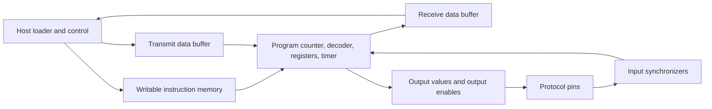

# Competition roadmap

## The goal

Build an open-source chip that runs small programs to read pins, drive pins, and control timing precisely.
A user must be able to load a new program after fabrication and implement another protocol within the chip's documented limits.
Demonstrate UART, SPI, and I2C using the programmable engine.
Deliver a verified, routable design in the competition's 6x4 allocation on IHP CMOS5L.

These goals follow the [competition announcement](https://blog.janestreet.com/protocol-emulator-asic-competition/).
The proposed architecture, milestones, dates, and test criteria below are our working plan, rather than additional competition rules.
The announced submission deadline is January 18, 2027.

## Where we are now

- [x] Start from the official CMOS5L template.
- [x] Set `info.yaml` to 6x4 tiles and identify the project.
- [x] Install a local simulator, linter, and isolated cocotb environment.
- [x] Pass local RTL lint and the template smoke test.
- [x] Configure GitHub workflows for CMOS5L GDS, precheck, gate-level simulation, and documentation.
- [x] Replace the example adder with the programmable emulator in `docs/spec.md`.
- [x] Run UART TX/RX, SPI controller and I2C controller programs against independent peers in RTL simulation.
- [x] Estimate area with yosys on the IHP liberty (`docs/area-log.md`).
- [x] Confirm the first remote GDS build passes and record routed area and timing (`docs/area-log.md`).
- [x] Add a reference model written from the specification and compare random programs against it (`test/test_random.py`).
- [x] Prove the fetch stage, buffer occupancy and reset outputs formally (`formal/`).
- [ ] Close setup timing at every corner at the documented clock.
- [ ] Choose and demonstrate the distinctive feature.

The architecture grew beyond the single engine proposed below: two engines plus general primitives, chosen to cover unplanned protocols.
The sections below remain as background; `docs/spec.md` is the current definition.

## Start here: transmit one UART byte

Your first useful deliverable is a UART transmitter that sends a byte through a top-level output pin.
Use a simple byte input, start handshake, and busy or ready indication for this exercise.
Document the chosen pins and behavior before writing the RTL.

1. Run `make check` and open `test/tb.fst` to understand the existing simulation.
2. Learn the top-level wrapper in `src/project.v`: inputs, outputs, bidirectional output enable, clock, and active-low reset.
3. Choose an initial UART baud rate and define the clock-to-bit-time relationship.
4. Write a cocotb receiver that observes the TX pin, decodes a complete frame, and checks both the byte and bit duration.
5. Implement the transmitter with a bit timer, shift register, and small state machine.
6. Test `0x00`, `0xff`, `0x55`, `0xaa`, consecutive frames, and reset during transmission.
7. Run lint and simulation, then push the implementation for a GDS build.

For this first exercise, define 8 data bits, no parity, and one stop bit.
Specify the allowed baud-rate error if the clock divisor cannot produce the requested rate exactly.
The test should check externally visible behavior independently of the RTL's state encoding.
The transmitter is a learning milestone; the final UART behavior must run as a program on the general engine.

## A starting architecture to evaluate

I recommend beginning with one deterministic execution engine and a small instruction set for pin operations and timing.
Use synthesis measurements and protocol programs to decide how much memory and buffering it needs.
The competition suggests [RP2040 PIO](https://www.raspberrypi.com/documentation/pico-sdk/hardware.html#hardware_pio) as inspiration.
Study its program execution and I/O interfaces before defining our own behavior.

This is a proposed block diagram, not an implemented design.
Start with one system clock and synchronous state updates.
Keep the Tiny Tapeout wrapper stable while developing the internal modules.

| Decision | What to establish before committing to it |
| --- | --- |
| Instruction semantics | Precise cycle counts for pin changes, sampling, waits, branches, and stalls |
| Minimal instruction set | Operations sufficient for UART, SPI, and I2C programs, such as write pins, read pins, wait cycles, wait on input, branch, and shift data |
| Program memory | Writable after fabrication, realistic capacity, measured mapped area, and supported macro integration if choosing SRAM |
| Host interface | A practical way to upload programs, start/stop execution, transfer bytes, and read status within the available pins |
| Data buffering | Explicit behavior when transmit data runs out or the receive buffer fills |
| Input synchronization | Documented sampling latency and its effect on waits and protocol timing |
| Pin drive modes | Output values, direction control, open-drain behavior, and safe reset states |
| Frequency target | A target justified by protocol timing needs and confirmed by routed timing |

Write a short instruction-set specification and a Python execution model before implementing the programmable core.
Assemble a UART TX program on paper and count its cycles to prove the instruction set can express the first protocol.
Treat memory choice as an early area decision: a Verilog array alone does not guarantee synthesis will use an SRAM macro.
Investigate the [Tiny Tapeout SRAM example](https://www.tinytapeout.com/chips/ttihp0p2/tt_um_urish_sram_test) linked from the competition if register-based storage consumes too much area.
Verify the selected macro is available and supported in CMOS5L before adopting it.
Choose additional engines or larger buffers only after measuring the first design.

## Phases and completion criteria

The dates are suggested targets starting October 2, 2026.
Move a milestone only after its completion criteria are met, and preserve the final submission buffer.

| Phase | Suggested window | Deliverable | Complete when |
| --- | --- | --- | --- |
| 1. Toolchain and UART baseline | Oct 2-11 | Tested UART TX, first successful GDS build | External receiver decodes correct bytes and timing; GDS and precheck pass |
| 2. Programmable core | Oct 12-Nov 1 | Instruction specification, model, assembler, loader, one engine | Uploading different programs changes behavior without editing RTL; UART TX works as firmware |
| 3. Protocol firmware | Nov 2-22 | UART TX/RX, SPI controller, I2C controller examples | Independent peers verify transfers and documented protocol modes |
| 4. Verification and distinctive feature | Nov 23-Dec 13 | Broader test suite and one compelling demonstration | Randomized model comparisons and corner cases pass; the distinctive feature has a reproducible demo |
| 5. Physical closure | Dec 14-Jan 3 | Final area/timing/routing fixes and gate-level regression | Full CMOS5L flow and precheck pass; routed timing meets the documented operating target |
| 6. Freeze and submit | Jan 4-17 | Reproducible release, documentation, demos, submission | A clean checkout reproduces checks; final artifacts and submission details are complete |

Run physical builds throughout phases 1-4.
Phase 5 is the final closure period, rather than the first opportunity to discover area or routing problems.
If an FPGA is available, exercise the same protocol programs against real devices during phases 3-4.
An FPGA demo supplements simulation and ASIC checks.

### Phase 2: make the chip programmable

Implement the program counter, instruction decoder, execution registers, timer, input sampling, and output control.
Add program upload and explicit start, halt, reset, and status behavior.
Provide a small assembler or encoder and a host upload example.
Test reset and program loading before testing long-running programs.

Define what happens when a program is invalid, a wait never completes, or the host requests a stop.
Decide whether program writes are permitted during execution and make that behavior testable.
A useful milestone is loading a pin-toggle program, then replacing it with UART firmware through the same interface.

### Phase 3: prove flexibility with protocols

For UART, cover transmit and receive, consecutive bytes, baud variation within a documented tolerance, and framing-error behavior.
For SPI, start with a documented controller mode, then expand clock polarity and phase coverage if the architecture supports it.
For I2C, cover start/stop, byte transfers, ACK/NACK, repeated starts, released lines, and clock stretching where supported.
Use bidirectional output enables to drive low or release an open-drain line, and model external pull-ups in the testbench.
Define a controller-only I2C scope initially and document whether arbitration is supported.

Record the supported rates, modes, limitations, and required external hardware for each example.
Run all examples on the same engine RTL and change only firmware and configuration.
Write peer models that inspect pins and transactions rather than reproducing the engine's instructions.

### Phase 4: verification and a reason to choose our design

Compare randomized instruction programs against the independent Python model.
Keep the random seed and failure waveform so a failure can be reproduced.
Exercise reset during execution, input changes near sampling boundaries, counter limits, program bounds, FIFO overflow/underflow, host stalls, and stuck protocol peers.
RTL simulation does not prove metastability behavior; review synchronizer structure and clock-domain assumptions separately.

Add formal checks for selected invariants if the toolchain and design support them.
Examples include safe reset pin directions, bounded program-counter behavior, and correct FIFO occupancy.
Prefer a few precise properties over an unsubstantiated claim that the entire design is formally verified.

Choose one distinctive feature after the base protocols work.
Possible directions are programmable fault injection, timestamped protocol capture/replay, or verification techniques with evidence of bugs caught.
The competition explicitly values unique functionality and novel design or verification approaches.
Evaluate the feature against area, timing, and the quality of its demonstration.
Treat USB and Ethernet as later stretch goals with their own electrical and timing requirements.

### Phase 5: prove the silicon implementation

Review mapped cell area, utilization, routing congestion, clock-tree overhead, and setup/hold timing from actual reports.
Resolve latch inference, unconstrained paths, and unexpected clock/reset structures.
Confirm that any memory macro is supported by this CMOS5L flow and passes physical integration checks.
Run the same externally driven protocol tests against the gate-level netlist.
Document whether gate-level tests include timing annotation; functional gate simulation alone does not establish timing closure.

Repeat the full GDS build after the last RTL or configuration change.
Save the build commit, reports, and artifacts together so the final results can be traced to the submitted source.

### Phase 6: make the project usable

Complete `info.yaml` pin descriptions and `docs/info.md` with the actual implemented design.
Publish the instruction reference, loader usage, example programs, protocol limitations, and measured operating limits.
Provide a clear board wiring guide and reproducible demonstration instructions.
Confirm the open-source license covers the code and any incorporated components.
Use the final submission form when the organizers publish it, and recheck the announcement for rule updates.

## Suggested working habits

Keep `main` usable and make feature changes on short-lived branches.
Run `make check` before pushing.
Require each substantial feature to include an external behavior test and a clear definition of success.
Add each new RTL file to `info.yaml`, `test/Makefile`, and the root lint command.
Keep an area/timing log with the source commit, memory size, cell area, routed timing, and major warnings.
Review the latest GDS result before increasing memory, adding another engine, or expanding the instruction set.

The UART TX milestone above and phases 1 to 3 are complete, as is most of phase 4's verification.
The next tasks are the open items under "Where we are now": timing closure at every corner, then the distinctive feature, measured against the closed design's area and timing.
